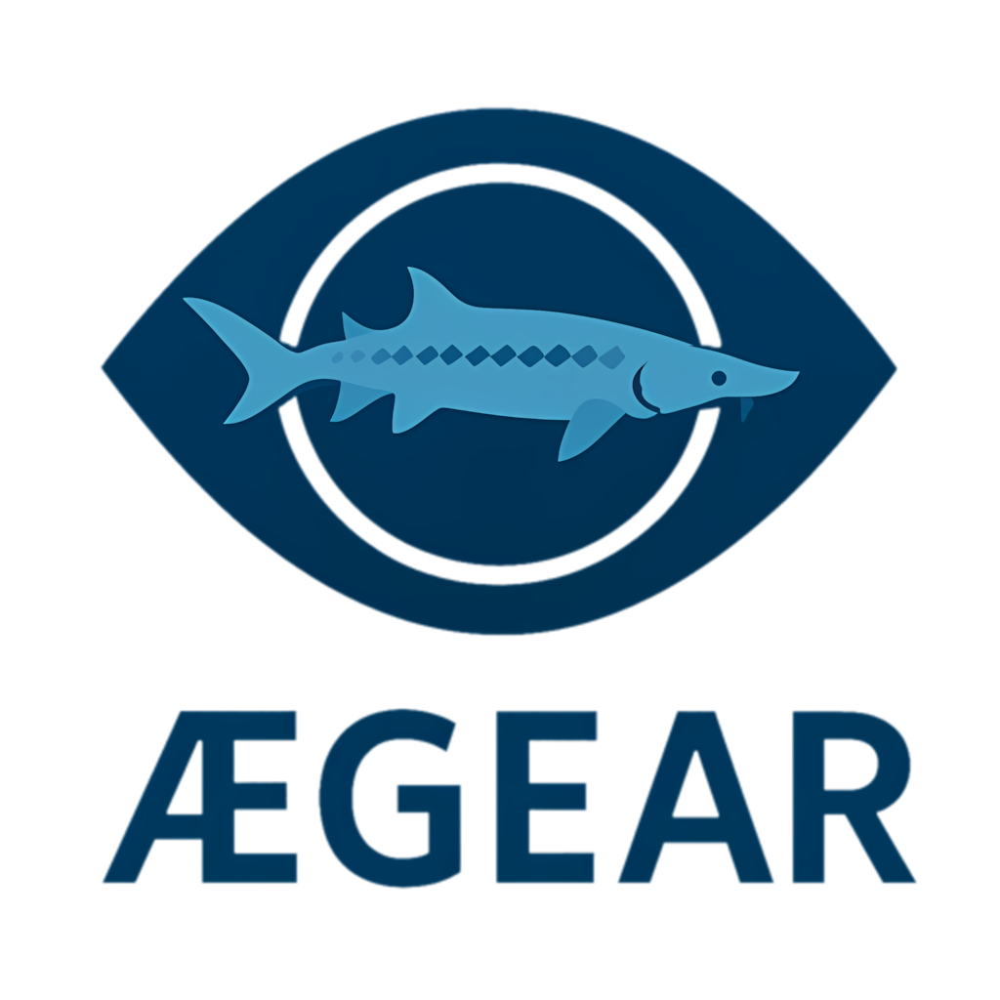
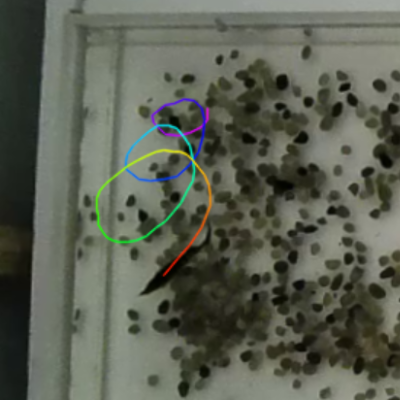
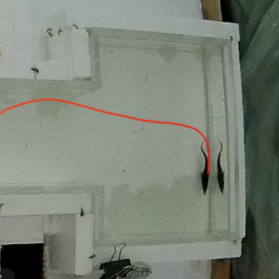

# Aegear


**Tracking and analyzing fish behavior in controlled aquaculture environments**

[](LICENSE)[](https://www.python.org/)[](https://ljubobratovicrelja.github.io/aegear/)[](https://hub.docker.com/r/ljubobratovicrelja/aegear)


<p align="center">
  
</p>

---


# 🧠 Project Overview

**Aegear** is a computer vision toolkit developed for the analysis of fish locomotion in controlled aquaculture environments. Originally designed for behavioral studies on juvenile Russian sturgeon (*Acipenser gueldenstaedtii*), the system enables robust detection and tracking of individual fish across a range of experimental conditions, including tanks with textured floors and heterogeneous lighting.

The name **Aegear** draws inspiration from **Ægir**, the Norse god of the sea, symbolizing its aquatic focus and its role as *eye-gear* — a visual tool for observation and discovery.

---

<p align="center">
  
  
</p>

---

## 🔬 Technical Summary

Aegear is a computer vision system for detecting and tracking fish in aquaculture tanks. It was initially applied in the doctoral research of Georgina Fazekas (2020– ), which explored environmental and feeding effects on juvenile sturgeon swimming behavior (*A. gueldenstaedtii*, *A. ruthenus*). The toolkit was created to overcome limitations in existing tracking systems, such as idtracker.ai (Romero-Ferrero et al., 2018), which require clean backgrounds and uniform lighting.

At its core, Aegear integrates:

- **Detection**: A U-Net-style segmentation network with an EfficientNet-B0 encoder backbone, trained via transfer learning on aquaculture-specific datasets.
- **Tracking**: A Siamese network architecture for appearance-based localization across frames, enabling robust trajectory reconstruction without manual re-identification.
- **Calibration**: Camera routines for intrinsic parameter estimation and extrinsic scaling from four reference points, allowing trajectory data to be expressed in metric units.

This modular pipeline supports robust fish localization, trajectory analysis, and data augmentation across varied experimental conditions, ensuring reproducibility and adaptability to other species and setups.

---

## 🚧 Known Limitations

- Currently limited to **single-object tracking**; no support yet for multi-class or multi-fish tracking.
- The detection model is trained on sterlet (*Acipenser ruthenus*) and Russian sturgeon (*Acipenser gueldenstaedtii*) video data and likely requires additional training for species with significantly different shapes or swimming patterns.

---

## 📦 Installation
Aegear can be installed either for development use in notebooks or as a GUI-based application.

🔧 Development / Notebook Usage
To install Aegear in editable mode with additional dependencies for training, notebooks, and analysis:

```bash
git clone https://github.com/ljubobratovicrelja/aegear.git
cd aegear
pip install -e .[dev]
```

**Note**: Best do this in an virtual environment because of heavy dependencies that Aegear carries along with its install.

This mode is ideal for working with Jupyter notebooks or customizing the codebase.

---

## 🚀 GUI Application (Early Access)

Aegear includes a desktop GUI built with Tkinter. Once installed, the app can be launched via:

```bash
aegear-gui
```

This requires Python ≥3.10 and a working Tkinter environment. Therefore make sure that Tkinter and Python with Tk support is installed on your machine.

### 🛠️ Prebuilt binaries

There are also included binaries made using PyInstaller for Win64 and macOS machines with Apple Silicon within [the release packages](https://github.com/ljubobratovicrelja/aegear/releases). However keep in mind that Windows builds include the basic PyTorch version (without CUDA). To run `aegear-gui` with CUDA, remove the preinstalled torch and [install your pytorch version](https://pytorch.org/) matching your installed CUDA runtime (Aegear models are tested using CUDA Toolkit version 12.4).

> ⚠️ Experimental Notice:
> The current GUI is designed specifically for the video format and calibration workflow used in the original Russian sturgeon experiments. It assumes a specific directory structure and input format.
> A more flexible and general-purpose GUI for broader use cases is under active development.

---

## 🤝 Contributions & Collaboration

Aegear was originally developed around a single research project in controlled aquaculture environments. While it is currently tailored to tracking fish under specific conditions, we envision Aegear growing into a more general-purpose toolkit for animal tracking in both **academic** and **industrial** settings.

We warmly invite:  
- 🧑‍🔬 Researchers in **biology, ethology, aquaculture**, or other animal behavior fields  
- 🏭 Practitioners in **industrial monitoring of animal populations**  
to explore Aegear and contact us for support or potential collaboration.  

If your use case involves different species, environments, or tracking requirements, we are happy to:  
- Extend Aegear for broader animal tracking scenarios  
- Discuss customizations and new features  
- Work together on shared challenges in visual tracking systems  

> 📌 **Feature Requests:** Open a GitHub issue if you require specific capabilities not yet available. We will prioritize these to make Aegear a useful resource for the wider community.

## 📖 Documentation

For detailed guides, tutorials, and API references, visit the full [project documentation](https://ljubobratovicrelja.github.io/aegear/).


## 🧠 Acknowledgments

Special thanks to Gina and Uroš from the HAKI research team, whose collaboration and encouragement sparked the development of this toolkit.


## 📖 References


> Fazekas, G.: Investigating the effects of environmental factors and feeding strategies on early life development and behavior of Russian sturgeon (Acipenser gueldenstaedtii) and sterlet (A. ruthenus) [Doctoral thesis].
> Hungarian University of Agriculture and Life Sciences (MATE), Hungary.  
>
> Romero-Ferrero, F., Bergomi, M. G., Hinz, R., Heras, F. J. H., & de Polavieja, G. G. (2018).
> idtracker.ai: tracking all individuals in small or large collectives of unmarked animals.
> Nature Methods, 16(2), 179–182. [arXiv:1803.04351]
>
> Tan, M., & Le, Q. V. (2019).
> EfficientNet: Rethinking Model Scaling for Convolutional Neural Networks.
> Proceedings of the 36th International Conference on Machine Learning, PMLR 97:6105–6114. arXiv:1905.11946
>
> Bertinetto, L., Valmadre, J., Henriques, J. F., Vedaldi, A., & Torr, P. H. S. (2016).
> Fully-Convolutional Siamese Networks for Object Tracking.
> European Conference on Computer Vision (ECCV) Workshops. arXiv:1606.09549
