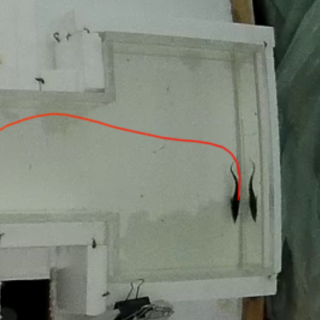

# Aegear


**Tracking and analyzing fish behavior in controlled aquaculture environments**

[](LICENSE)[](https://www.python.org/)[](#)

<p align="center">
  
</p>

---


## 🧠 Project Overview

**Aegear** is a computer vision toolkit developed for the analysis of fish locomotion in controlled aquaculture environments. Originally designed for behavioral studies on juvenile Russian sturgeon (*Acipenser gueldenstaedtii*), the system enables robust detection and tracking of individual fish across a range of experimental conditions, including tanks with textured floors and heterogeneous lighting.

The toolkit addresses the need for accurate, reproducible behavioral metrics in video-based aquaculture experiments. It provides a complete pipeline for fish localization, trajectory tracking, scene calibration, and data augmentation — with a focus on modularity, reusability, and extensibility to other species and experimental setups.

The name **Aegear** references **Ægir**, the Norse god of the sea, symbolizing the system's focus on aquatic environments, while also invoking *eye-gear* — a metaphor for visual instrumentation and observation.

---


<p align="center">
  
  
</p>

---

## 🔬 Project Summary

At the core of Aegear is a deep learning model for spatial fish localization, built on a U-Net-style architecture with an EfficientNet B0 encoder backbone. The encoder is initialized from `torchvision.models.efficientnet_b0(weights='IMAGENET1K_V1')`, with the first three stages frozen during training to preserve generic visual features. Decoder layers perform progressive upsampling using transposed convolutions, with skip connections linking each encoder stage to its corresponding decoder layer.

The model produces a single-channel heatmap that reflects the likelihood and position of the fish within the input frame. Supervision is carried out using a weighted binary cross-entropy loss that emphasizes central activations, combined with a custom centroid distance loss to directly penalize spatial errors in predicted heatmap peaks. This training objective ensures precise localization under class imbalance and subtle visual cues.

Tracking is initialized using a sliding-window search constrained by motion segmentation via OpenCV’s KNN background subtraction algorithm (Zivkovic & van der Heijden, 2006). Once the target is detected, subsequent frames are processed with local search around the last known position. This localized tracking strategy offers robust performance in dynamic or noisy visual conditions and supports real-time execution on modern CUDA-enabled GPUs.

To allow for real-world quantification, Aegear includes a calibration module for metric scaling. Intrinsic parameters are obtained using Zhang’s method based on checkerboard imagery, while extrinsic calibration is performed by selecting four known reference points within the tank environment. This enables accurate reconstruction of fish trajectories in metric units (e.g., centimeters), suitable for downstream analysis of activity levels and behavioral patterns.

In addition to the main pipeline, Aegear includes tools for:
- camera calibration and manual ROI annotation from videos,
- COCO-style dataset generation and polygon-to-heatmap conversion using distance transforms,
- synthetic dataset augmentation by compositing fish onto complex backgrounds.

---

## 📚 Publications & Citations

Aegear was originally developed as a tool to assist the PhD project of Georgina Fazekas (2020- ), which investigated how environmental and feeding strategies affect the swimming activity and behavior in juvenile sturgeons. The first iteration of the software focused on producing consistent fish localization and movement metrics in video-based trials.

While existing tools such as [idtracker.ai](https://idtracker.ai/latest/) (Romero-Ferrero et al., 2018) have made significant advances in animal tracking in controlled laboratory setups, they often require clean backgrounds and consistent lighting to operate effectively. Aegear was initiated specifically to address the limitations of such systems in real aquaculture conditions, where floor texture, lighting, and water reflections introduce noise and complexity not handled well by traditional segmentation-based pipelines.

> Fazekas, G.: Investigating the effects of environmental factors and feeding strategies on early life development and behavior of Russian sturgeon (Acipenser gueldenstaedtii) and sterlet (A. ruthenus) [Doctoral thesis].
> Hungarian University of Agriculture and Life Sciences (MATE), Hungary.  
>
> Romero-Ferrero, F., Bergomi, M. G., Hinz, R., Heras, F. J. H., & de Polavieja, G. G. (2018).
> idtracker.ai: tracking all individuals in small or large collectives of unmarked animals.
> Nature Methods, 16(2), 179–182. [arXiv:1803.04351]

Since that initial application, Aegear has significantly expanded in scope. The pipeline has undergone several architectural revisions, added support tools (e.g., dataset generation, synthetic augmentation, calibration), and now includes predictive motion modeling via temporal networks. Aegear is an actively evolving project aimed at providing a generalizable, modular framework for aquatic behavioral analysis, with open-ended support for future enhancements and applications beyond the original sturgeon experiments.

---

## 🚧 Known Limitations

- Currently limited to **single-object tracking**; no support yet for multi-class or multi-fish tracking.
- The detection model is specialized for Russian sturgeon and likely should be retrained for other species.

---

## 🔮 Future Work

Aegear is under active development and continues to expand beyond its initial scope. Planned or experimental features include:

Trajectory prediction with temporal modeling: A GRU-based module is currently under development to process sequences of spatial heatmaps and predict the fish’s next position. This temporal prior aims to improve tracking stability under occlusion, noise, or visually ambiguous scenes.

Multi-object support: Future releases may introduce multi-fish tracking, requiring new detection and association logic.

Species generalization: Although the current model is specialized for Russian sturgeon, efforts are underway to make the system more broadly applicable across species via fine-tuning and transfer learning.

---

## 📜 License

This project is licensed under the [MIT License](LICENSE).

---

## 📦 Installation
Aegear can be installed either for development use in notebooks or as a GUI-based application.

🔧 Development / Notebook Usage
To install Aegear in editable mode with additional dependencies for training, notebooks, and analysis:

```bash
git clone https://github.com/ljubobratovicrelja/aegear.git
cd aegear
pip install -e .[dev]
```

This mode is ideal for working with Jupyter notebooks or customizing the codebase.

---

## 🚀 GUI Application (Early Access)

Aegear includes a desktop GUI built with Tkinter. Once installed, the app can be launched via:

```bash
aegear-gui
```

This requires Python ≥3.10 and a working Tkinter environment. If you're installing system-wide, make sure tkinter is available (e.g., sudo apt install python3-tk on Ubuntu/Debian).

> ⚠️ Experimental Notice:
> The current GUI is designed specifically for the video format and calibration workflow used in the original Russian sturgeon experiments. It assumes a specific directory structure and input format.
> A more flexible and general-purpose GUI for broader use cases is under active development.

---

## 🧠 Acknowledgments

Special thanks to Gina and Uroš from the HAKI research team, whose collaboration and encouragement sparked the development of this toolkit.