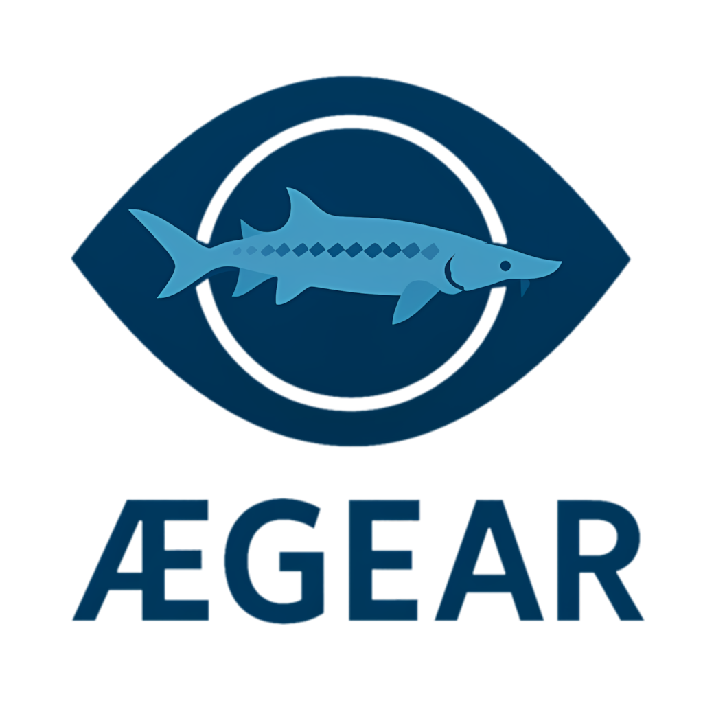

# Aegear


**Tracking and analyzing fish behavior in controlled aquaculture environments**

[](LICENSE)[](https://www.python.org/)[](#)

<p align="center">
  
</p>

---


## 🧠 Project Overview

**Aegear** is a computer vision toolkit developed for the analysis of fish locomotion in controlled aquaculture environments. Originally designed for behavioral studies on juvenile Russian sturgeon (*Acipenser gueldenstaedtii*), the system enables robust detection and tracking of individual fish across a range of experimental conditions, including tanks with textured floors and heterogeneous lighting.

The toolkit addresses the need for accurate, reproducible behavioral metrics in video-based aquaculture experiments. It provides a complete pipeline for fish localization, trajectory tracking, scene calibration, and data augmentation — with a focus on modularity, reusability, and extensibility to other species and experimental setups.

The name **Aegear** references **Ægir**, the Norse god of the sea, symbolizing the system's focus on aquatic environments, while also invoking *eye-gear* — a metaphor for visual instrumentation and observation.

---


<p align="center">
  
  
</p>

---

## 🔬 Project Summary

At the core of Aegear is a deep learning system for spatial fish localization and tracking in video. The primary detection model is a **U-Net**-style architecture with an **EfficientNet-B0** encoder backbone, initialized from `torchvision.models.efficientnet_b0(weights='IMAGENET1K_V1')`. The first three encoder stages are frozen during training to retain general visual features. Decoder layers use transposed convolutions with skip connections to restore spatial resolution.

The model outputs a single-channel heatmap representing fish likelihood and position within each frame. Training uses a combination of weighted binary cross-entropy (focusing on central activations) and a custom centroid distance loss that penalizes spatial errors in predicted heatmap peaks, improving precision under class imbalance and subtle cues.

Tracking starts with the **EfficientUNet** detector applied in a sliding-window over the entire frame, using a motion mask from OpenCV’s KNN background subtractor (Zivkovic & van der Heijden, 2006). Once the fish is found, Aegear switches to a **Siamese** tracker that shares the EfficientNet-B0 encoder and reuses its weights. It extracts multi-level features from both the last ROI (template) and the current ROI (search), concatenates them, and decodes via a multi-stage upsampling path to produce a high-resolution response heatmap for precise, drift-free localization. Confidence-guided frame skipping optimizes speed. If confidence drops, Aegear falls back to sliding-window detection with the original EfficientUNet to re-initialize, ensuring robust tracking even under occlusion or appearance changes.

For real-world analysis, Aegear includes a calibration module with intrinsic parameter estimation via Zhang’s method and extrinsic metric scaling from four known tank reference points. This enables reconstruction of fish trajectories in metric units (e.g., centimeters), suitable for behavioral and activity-level studies.

---

## 📚 Publications & Citations

Aegear was originally developed as a tool to assist the PhD project of Georgina Fazekas (2020- ), which investigated how environmental and feeding strategies affect the swimming activity and behavior in juvenile sturgeons. The first iteration of the software focused on producing consistent fish localization and movement metrics in video-based trials.

While existing tools such as [idtracker.ai](https://idtracker.ai/latest/) (Romero-Ferrero et al., 2018) have made significant advances in animal tracking in controlled laboratory setups, they often require clean backgrounds and consistent lighting to operate effectively. Aegear was initiated specifically to address the limitations of such systems in real aquaculture conditions, where floor texture, lighting, and water reflections introduce noise and complexity not handled well by traditional segmentation-based pipelines.

The current system integrates an EfficientUNet model built on EfficientNet-B0 (Tan & Le, 2019) for detection, and a Siamese network for visual tracking inspired by fully convolutional Siamese trackers (Bertinetto et al., 2016), enabling fast, appearance-based localization without manual re-identification.

> Fazekas, G.: Investigating the effects of environmental factors and feeding strategies on early life development and behavior of Russian sturgeon (Acipenser gueldenstaedtii) and sterlet (A. ruthenus) [Doctoral thesis].
> Hungarian University of Agriculture and Life Sciences (MATE), Hungary.  
>
> Romero-Ferrero, F., Bergomi, M. G., Hinz, R., Heras, F. J. H., & de Polavieja, G. G. (2018).
> idtracker.ai: tracking all individuals in small or large collectives of unmarked animals.
> Nature Methods, 16(2), 179–182. [arXiv:1803.04351]
>
> Tan, M., & Le, Q. V. (2019).
> EfficientNet: Rethinking Model Scaling for Convolutional Neural Networks.
> Proceedings of the 36th International Conference on Machine Learning, PMLR 97:6105–6114. arXiv:1905.11946
>
> Bertinetto, L., Valmadre, J., Henriques, J. F., Vedaldi, A., & Torr, P. H. S. (2016).
> Fully-Convolutional Siamese Networks for Object Tracking.
> European Conference on Computer Vision (ECCV) Workshops. arXiv:1606.09549

---

## 🚧 Known Limitations

- Currently limited to **single-object tracking**; no support yet for multi-class or multi-fish tracking.
- The detection model is specialized for Russian sturgeon and likely should be retrained for other species.

---

## 🔮 Future Work

Aegear is under active development and continues to expand beyond its initial scope. Planned or experimental features include:

Multi-object support: Future releases may introduce multi-fish tracking, requiring new detection and association logic.

Species generalization: Although the current model is specialized for Russian sturgeon, efforts are underway to make the system more broadly applicable across species via fine-tuning and transfer learning.

---

## 📜 License

This project is licensed under the [MIT License](LICENSE).

---

## 📦 Installation
Aegear can be installed either for development use in notebooks or as a GUI-based application.

🔧 Development / Notebook Usage
To install Aegear in editable mode with additional dependencies for training, notebooks, and analysis:

```bash
git clone https://github.com/ljubobratovicrelja/aegear.git
cd aegear
pip install -e .[dev]
```

**Note**: Best do this in an virtual environment because of heavy dependencies that Aegear carries along with its install.

This mode is ideal for working with Jupyter notebooks or customizing the codebase.

---

## 🚀 GUI Application (Early Access)

Aegear includes a desktop GUI built with Tkinter. Once installed, the app can be launched via:

```bash
aegear-gui
```

This requires Python ≥3.10 and a working Tkinter environment. Therefore make sure that Tkinter and Python with Tk support is installed on your machine.

### 🛠️ Prebuilt binaries

There are also included binaries made using PyInstaller for Win64 and macOS machines with Apple Silicon within [the release packages](https://github.com/ljubobratovicrelja/aegear/releases). However keep in mind that Windows builds include the basic PyTorch version (without CUDA). To run `aegear-gui` with CUDA, remove the preinstalled torch and [install your pytorch version](https://pytorch.org/) matching your installed CUDA runtime (Aegear models are tested using CUDA Toolkit version 12.4).

> ⚠️ Experimental Notice:
> The current GUI is designed specifically for the video format and calibration workflow used in the original Russian sturgeon experiments. It assumes a specific directory structure and input format.
> A more flexible and general-purpose GUI for broader use cases is under active development.

---

## 🧠 Acknowledgments

Special thanks to Gina and Uroš from the HAKI research team, whose collaboration and encouragement sparked the development of this toolkit.
