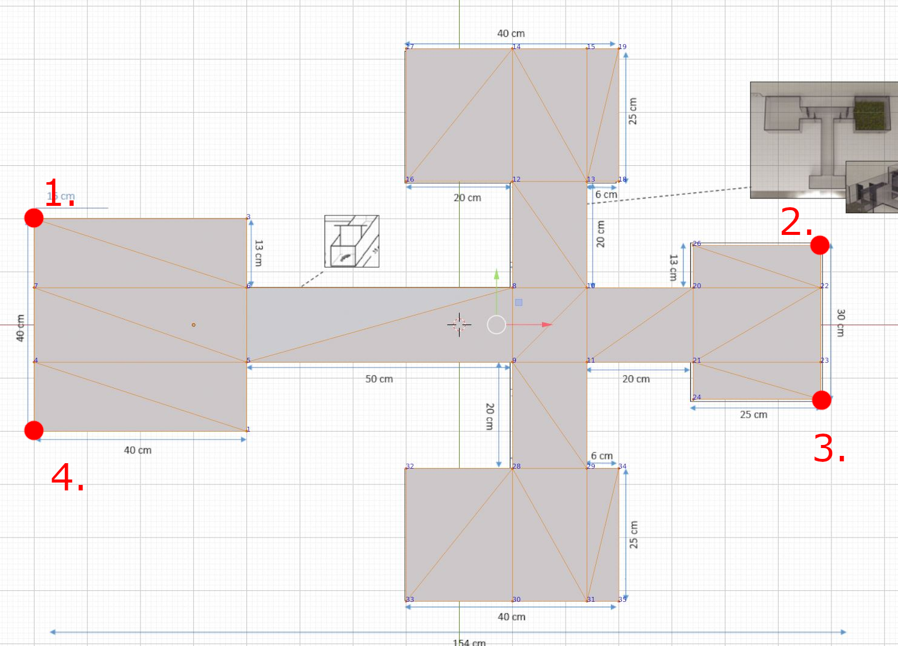

# Camera and Scene Calibration

Aegear supports **scene calibration** directly in the GUI and provides a separate script for **lens (intrinsic) calibration**. This page explains the difference between the two, how to perform lens calibration using the integrated script, and how to update Aegear with new calibration data.

---

## 🎯 Scene Calibration (GUI)

Scene calibration in Aegear maps the video’s pixel coordinates to real-world metric units (e.g., centimeters). This is achieved by selecting four reference points in the video that define the scale and orientation of the scene.

- **Where?**: Available in the Aegear GUI under the *Calibrate* button.
- **What it does?**
    - Computes a homography for planar mapping.
    - Allows Aegear to report trajectories in metric units.

- **Picking Reference Points**
    - The user is asked to click 4 reference points in sequence. These should be picked in the order shown below.



> 🔴 Points 1–4 represent the corners of the reference area used for scaling and orientation.

> 📌 **Note**: Custom scene reference points (beyond 4 corners) are not yet supported in the GUI. If you require this feature, please open a GitHub issue—we will prioritize adding it.

> 📌 Scene calibration **does not correct lens distortion**.

---

## 📷 Lens Calibration (Intrinsic Calibration)

Lens calibration, or intrinsic calibration, is a separate process that corrects optical distortions (e.g., barrel or pincushion distortion) and defines camera parameters.

- **Where?**: Not yet available in the GUI.
- **Tool**: Use the provided script:
  ```bash
  python tools/calibration.py calibration_descriptor.json
  ```

### 📑 Calibration Descriptor (`calibration_descriptor.json`)

Example:
```json
{
    "videoPath": "data/videos/2016_0718_200947_002.MOV",
    "calibrationDataPath": "data/calibration.xml",
    "patternSize": [8, 6],
    "subPixWinSize": [5, 5],
    "patternSquareSideLength": 1.6,
    "skipFrames": 120
}
```

**Fields:**

| Field                     | Description                                     |
|---------------------------|-------------------------------------------------|
| `videoPath`               | Path to calibration video (checkerboard pattern). |
| `calibrationDataPath`     | Output XML file path for calibration data.      |
| `patternSize`             | Size of checkerboard grid (columns, rows).      |
| `subPixWinSize`           | Window size for corner refinement (pixels).     |
| `patternSquareSideLength` | Size of one checkerboard square (cm).           |
| `skipFrames`              | Process every Nth frame for efficiency.         |

### 🏃 Steps
1. Record a video of a checkerboard pattern covering the camera’s field of view.
2. Update `calibration_descriptor.json` with your video and parameters.
3. Run the calibration script.
4. The script produces an updated `calibration.xml`.

### 📦 Update Aegear
Copy the resulting `calibration.xml` to:
```
config/calibration.xml
```
This ensures Aegear uses the corrected intrinsic parameters.

---

## 🔑 Summary: Scene vs Lens Calibration

| Feature                  | Scene Calibration        | Lens Calibration            |
|--------------------------|---------------------------|------------------------------|
| Corrects Lens Distortion | ❌                        | ✅                           |
| Converts Pixels to Metric| ✅                        | ✅ (indirectly)              |
| Location in Aegear       | GUI (*Calibrate*)         | CLI (`tools/calibration.py`) |
| Output                   | Homography                | Intrinsic matrix & distortion coefficients |

---

## 📝 Notes

- Lens calibration should be performed **once per camera setup** and reused.
- Scene calibration is required **per video** if camera/view changes.
- Future versions of Aegear may integrate lens calibration and custom scene reference point systems into the GUI.