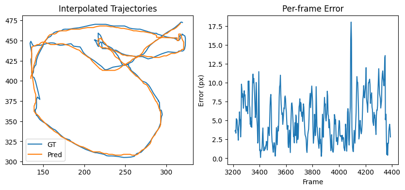

# 🐟 Aegear Tracking API Tutorial

This tutorial demonstrates how to benchmark the **Aegear fish tracking system** using its Python API.
It walks you through:

1. Downloading a test dataset and pre-trained models
2. Running the tracker on a sample video
3. Comparing predicted trajectories to ground truth
4. Visualizing performance metrics and errors

The code here can be saved as a standalone script or adapted into your own projects.

Note that this is a breakdown and tutorial form of the [tracking benchmark notebook](https://github.com/ljubobratovicrelja/aegear/blob/main/notebooks/tracking_benchmark.ipynb) from Aegear repository. Feel free to refer to the notebook if it is more convenient to follow and run the code in that form.

---

## 📦 Requirements

Ensure you have these installed:

- `torch`
- `numpy`
- `scipy`
- `matplotlib`
- `tqdm`
- `aegear` (your local module)

For detailed installation info, please see the [installation](installation.md) page.

---

## 📁 Imports and Configuration

We start by importing all dependencies and defining configuration constants for dataset and model paths.

```python
import os
import json
from urllib.request import urlretrieve

import numpy as np
from scipy.interpolate import Rbf
import matplotlib.pyplot as plt

import torch
from tqdm import tqdm

from aegear.tracker import FishTracker
from aegear.video import VideoClip
from aegear.gui.progress_reporter import ProgressReporter
import aegear.utils as utils

# Paths and URLs
DATASET_DIR = "../data/training"
VIDEO_DIR = "../data/video"
MODELS_DIR = "../models"
PUBLIC_BASE_URL = "https://storage.googleapis.com/aegear-training-data"

# Annotation metadata
ANNOTATIONS_INFO = {
    "4_per_23": {
        "file": "tracking_4_per_23_clean.json",
        "annotation_url": f"{PUBLIC_BASE_URL}/tracking/tracking_4_per_23_clean.json",
        "video_url": f"{PUBLIC_BASE_URL}/video/4_per_23.MOV"
    },
}

# Tracker parameters
TESTING_PERCENTAGE = 0.5  # Evaluate on 50% of frames
TRACKING_THRESHOLD = 0.95
DETECTION_THRESHOLD = 0.95
TRACKING_MAX_SKIP = 3
```

---

## ⚡ Device Selection

Choose the best available compute device (MPS for Apple Silicon, CUDA for GPUs, or fallback to CPU).

```python
def select_device():
    """Select MPS (Apple), CUDA, or CPU."""
    if torch.backends.mps.is_available():
        return torch.device("mps")
    elif torch.cuda.is_available():
        return torch.device("cuda")
    return torch.device("cpu")
```

---

## ⬇️ Download Dataset and Models

Fetch the video and annotations if they don’t already exist locally.

```python
def download_dataset():
    """
    Download video and annotation files if not present locally.
    Returns loaded annotations and video file path.
    """
    os.makedirs(DATASET_DIR, exist_ok=True)
    os.makedirs(VIDEO_DIR, exist_ok=True)

    test_set = []
    video_file = None

    bar = tqdm(ANNOTATIONS_INFO.items(), desc="Downloading dataset")

    for key, ann in ANNOTATIONS_INFO.items():
        bar.set_postfix_str(key)
        annotations_file = os.path.join(DATASET_DIR, ann["file"])
        video_file = os.path.join(VIDEO_DIR, f"{key}.MOV")

        if not os.path.exists(annotations_file):
            print(f"Downloading annotations: {ann['annotation_url']}")
            urlretrieve(ann["annotation_url"], annotations_file)

        if not os.path.exists(video_file):
            print(f"Downloading video: {ann['video_url']}")
            urlretrieve(ann['video_url'], video_file)

        with open(annotations_file, "r") as f:
            test_set.append(json.load(f))

    return test_set, video_file
```

---

## 📊 Progress Reporting with TQDM

We extend Aegear’s `ProgressReporter` to use `tqdm` for progress bars in the CLI or notebooks.

```python
class TqdmProgressReporter(ProgressReporter):
    """Progress reporter using tqdm."""
    def __init__(self, start_frame, end_frame):
        self.total = end_frame - start_frame
        self.pbar = tqdm(total=self.total, desc="Tracking Progress")
        self.last_frame = start_frame

    def update(self, current_frame):
        self.pbar.update(current_frame - self.last_frame)
        self.last_frame = current_frame

    def still_running(self):
        return True

    def close(self):
        self.pbar.close()
```

---

## 🚀 Run Tracking and Evaluate

This function initializes the tracker, processes a portion of the video, and compares predictions to ground truth.

```python
def run_tracking_and_evaluate():
    """
    Run tracking and evaluate performance.
    """
    device = select_device()
    print("Using device:", device)

    test_set, video_file = download_dataset()
    annotations = test_set[0]
    video = VideoClip(video_file)

    # Ground truth
    gt_tracking = {item["frame_id"]: tuple(item["coordinates"]) for item in annotations["tracking"]}

    # Prediction storage
    pred_tracking = {}
    def model_track_register(frame_id, centroid, confidence):
        pred_tracking[frame_id] = (centroid, confidence)

    # Load models
    heatmap_model_path = str(utils.get_latest_model_path(MODELS_DIR, "model_efficient_unet"))
    siamese_model_path = str(utils.get_latest_model_path(MODELS_DIR, "model_siamese"))

    print("Using models:")
    print(f"  - UNet: {os.path.basename(heatmap_model_path)}")
    print(f"  - Siamese: {os.path.basename(siamese_model_path)}")

    tracker = FishTracker(
        heatmap_model_path=heatmap_model_path,
        siamese_model_path=siamese_model_path,
        tracking_threshold=TRACKING_THRESHOLD,
        detection_threshold=DETECTION_THRESHOLD,
        tracking_max_skip=TRACKING_MAX_SKIP,
    )

    # Define range
    num_frames_tested = int(len(gt_tracking) * TESTING_PERCENTAGE)
    tracking_start = min(gt_tracking.keys()) + num_frames_tested
    tracking_end = tracking_start + num_frames_tested

    reporter = TqdmProgressReporter(tracking_start, tracking_end)

    tracker.run_tracking(
        video,
        tracking_start,
        tracking_end,
        model_track_register,
        progress_reporter=reporter,
        ui_update=None
    )

    # Evaluate
    evaluate_tracking(gt_tracking, pred_tracking, video)
```

---

## 📈 Evaluate and Visualize Results

After tracking, we use RBF interpolation to align predicted and ground truth trajectories for error analysis.

```python
def evaluate_tracking(gt_tracking, pred_tracking, video):
    """
    Compare predicted and ground truth trajectories.
    Plot error metrics and trajectories.
    """
    gt_frames = np.array(sorted(gt_tracking.keys()))
    gt_coords = np.array([gt_tracking[f] for f in gt_frames])

    pred_frames = np.array(sorted(pred_tracking.keys()))
    pred_coords = np.array([pred_tracking[f][0] for f in pred_frames])

    # RBF interpolation
    rbf_gt_x = Rbf(gt_frames, gt_coords[:, 0], function='multiquadric', epsilon=0.5)
    rbf_gt_y = Rbf(gt_frames, gt_coords[:, 1], function='multiquadric', epsilon=0.5)
    rbf_pred_x = Rbf(pred_frames, pred_coords[:, 0], function='multiquadric', epsilon=0.5)
    rbf_pred_y = Rbf(pred_frames, pred_coords[:, 1], function='multiquadric', epsilon=0.5)

    gt_interp = np.stack([rbf_gt_x(pred_frames), rbf_gt_y(pred_frames)], axis=1)
    pred_interp = np.stack([rbf_pred_x(pred_frames), rbf_pred_y(pred_frames)], axis=1)

    # Compute errors
    errors = np.linalg.norm(gt_interp - pred_interp, axis=1)

    print("\nTracking Error Statistics:")
    print(f"  Mean error: {np.nanmean(errors):.2f} px")
    print(f"  Median error: {np.nanmedian(errors):.2f} px")
    print(f"  Frames within 3px: {(errors < 3).sum() / len(errors):.2%}")
    print(f"  Frames within 5px: {(errors < 5).sum() / len(errors):.2%}")
    print(f"  Frames within 10px: {(errors < 10).sum() / len(errors):.2%}")
    print(f"  False hits (>20px): {(errors > 20).sum() / len(errors):.2%}")

    # Plot
    plt.figure(figsize=(10, 4))
    plt.subplot(1, 2, 1)
    plt.plot(gt_interp[:, 0], gt_interp[:, 1], label='Ground Truth')
    plt.plot(pred_interp[:, 0], pred_interp[:, 1], label='Prediction')
    plt.legend()
    plt.title("Interpolated Trajectories")

    plt.subplot(1, 2, 2)
    plt.plot(pred_frames, errors)
    plt.title("Per-frame Error")
    plt.xlabel("Frame")
    plt.ylabel("Error (px)")
    plt.tight_layout()
    plt.show()
```

### 📷 Example Output

Here’s an example of the output produced by the `evaluate_tracking` function:



- **Left:** Interpolated Ground Truth vs Predicted trajectories
- **Right:** Per-frame error over time

This visualization helps you quickly assess tracker performance.

---

## ▶️ Running the Tutorial

To run the full benchmark script:

```python
if __name__ == "__main__":
    run_tracking_and_evaluate()
```

This will download the dataset, run tracking, and print performance statistics.

---

## 📌 Summary

This tutorial showed how to use the Aegear API for:

- Running the fish tracker on real data
- Evaluating predictions against ground truth
- Visualizing performance with error metrics

You can now adapt this workflow into your own scripts or pipelines.
